# DevOps Journey

This repository documents my DevOps learning journey — from basic Linux commands to system monitoring, networking, and automation.

---

## Day 1 — Linux & Git Basics

### Linux File Operations & Permissions

In this step, I practiced basic Linux commands:

- create directories (mkdir)
- navigate between folders (cd, pwd)
- create files (touch)
- view files (ls -l, cat)
- manage permissions (chmod)

📸 Example:

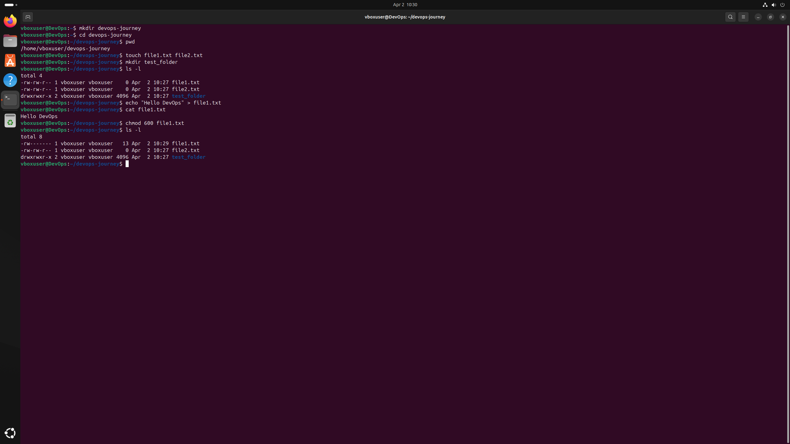

---

### Git Remote & First Push

Connected local repository to GitHub and made the first push:

- set remote repository (git remote add/set-url)
- push code to GitHub (git push)

📸 Example:

---

### Git Commit & Push Workflow

Practiced basic Git workflow:

- add changes (git add)
- commit changes (git commit)
- push changes (git push)

📸 Example:

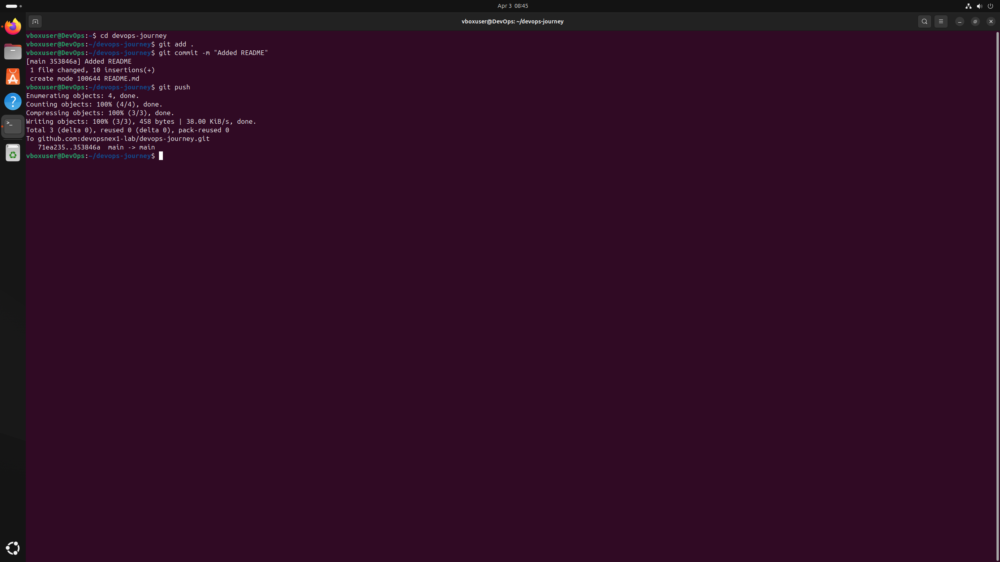

---

## Day 2 — System Monitoring & Bash

### System Monitoring & Processes

In this step, I learned how to monitor and analyze system processes in Linux:

- view all running processes (ps aux)
- monitor system in real time (top)
- check CPU and memory usage
- use htop for better visualization

📸 Example:

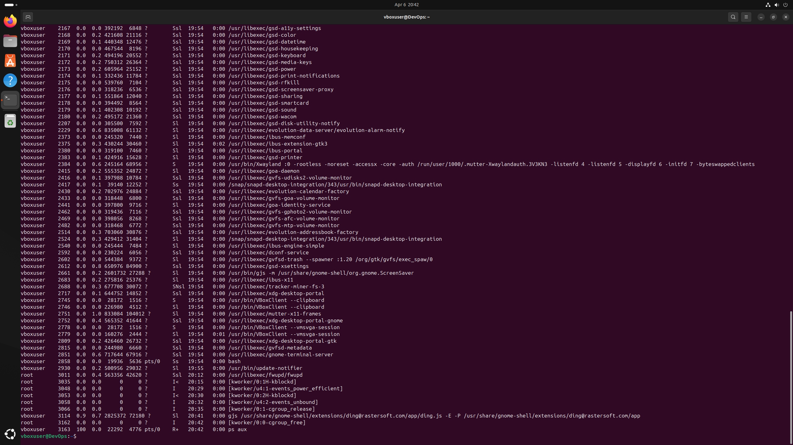
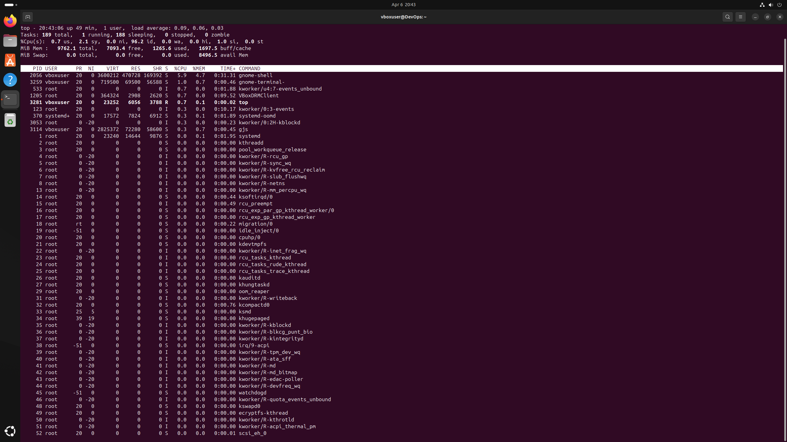
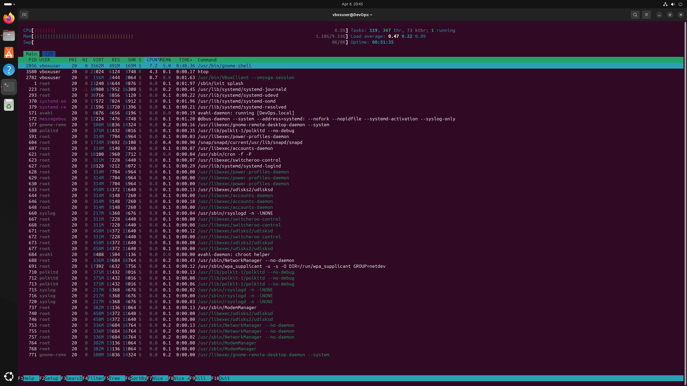

---

### Bash Script Basics

In this step, I created my first Bash script to display system information:

- current user (whoami)
- working directory (pwd)
- system info (uname -a)
- disk usage (df -h)
- memory usage (free -h)

📸 Example:

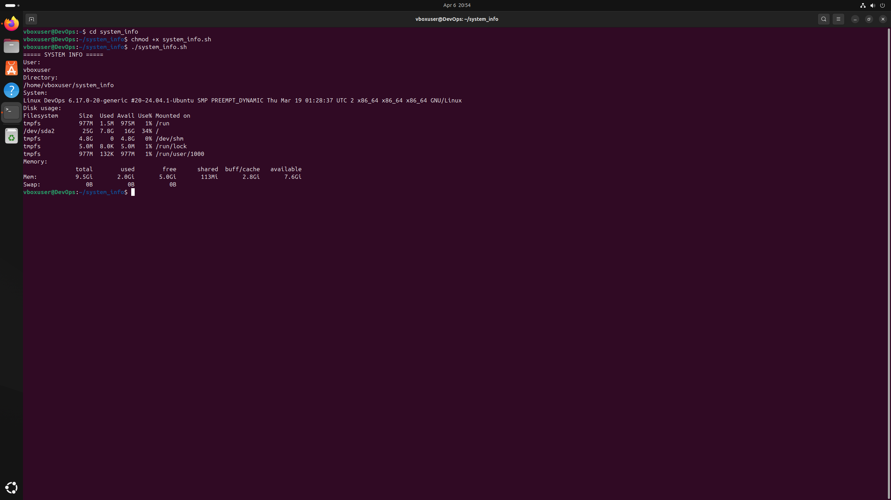

---

## Day 3 — Logs & System Analysis

### System Logs & Monitoring

In this step, I learned how to analyze system logs and detect errors:

- used journalctl to view system logs
- filtered logs by priority (errors)
- viewed recent logs using journalctl -n
- monitored logs in real time using tail

📸 Example:

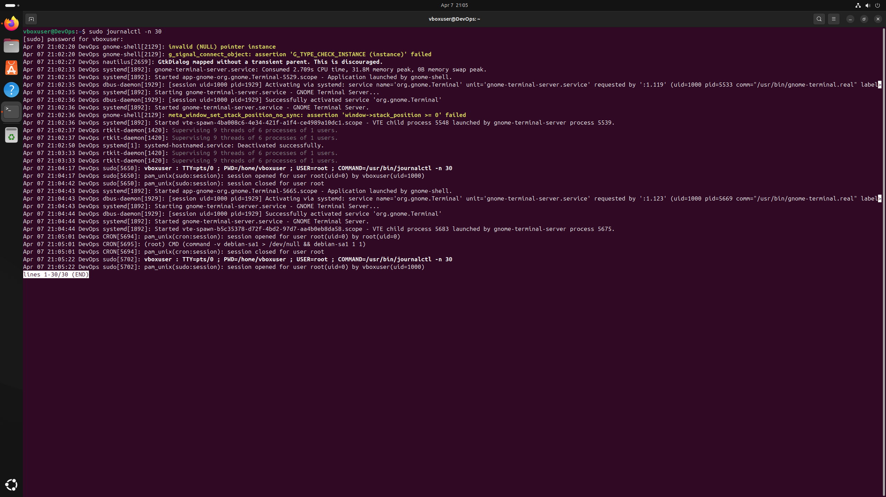
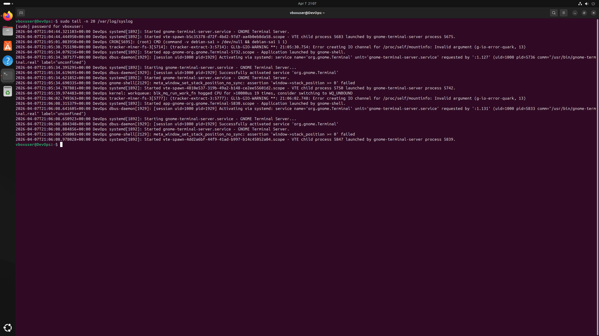
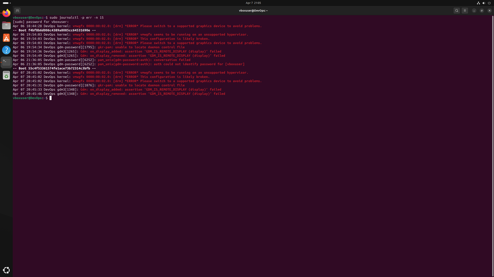

---

### Bash Automation

In this step, I created a script to check system status:

- system uptime
- disk usage
- memory usage
- top CPU processes
- recent errors

📸 Example:

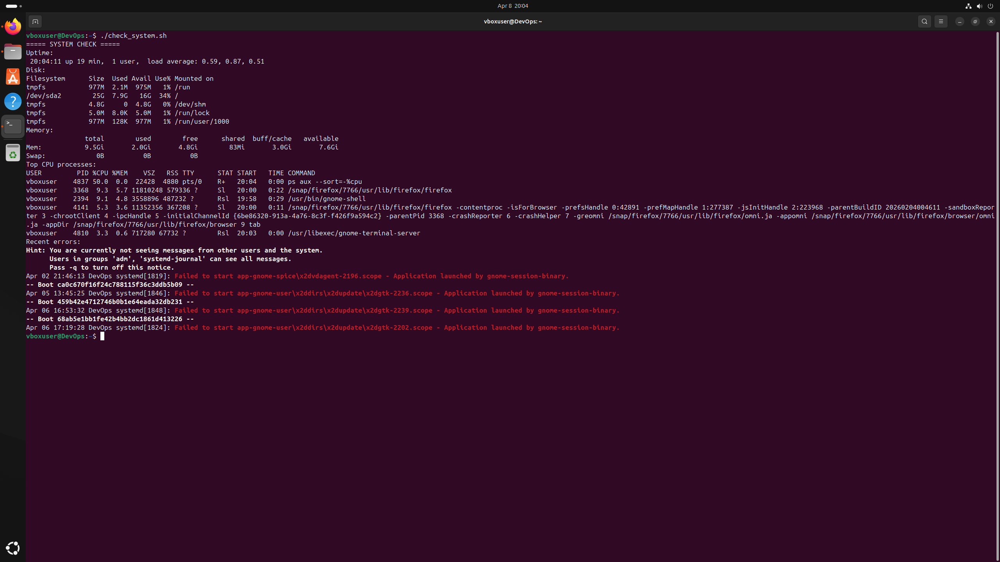

---

## Day 4 — Network Diagnostics

### Network Commands

In this step, I practiced basic network troubleshooting:

- check connectivity (ping)
- view open ports (ss -tuln)
- check IP address (ip a)
- test DNS resolution (nslookup)
- check HTTP response (curl -I)

📸 Example:

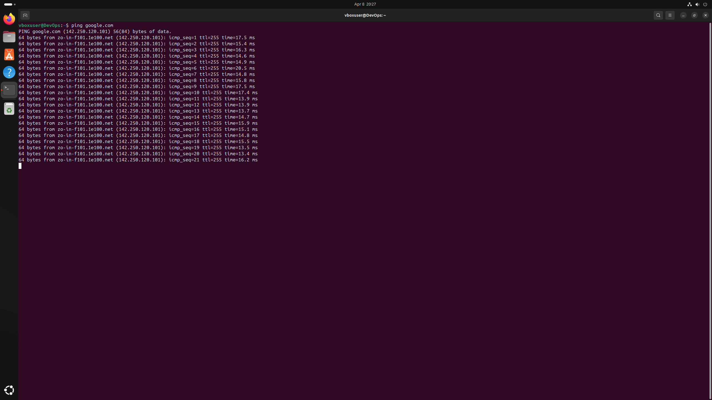
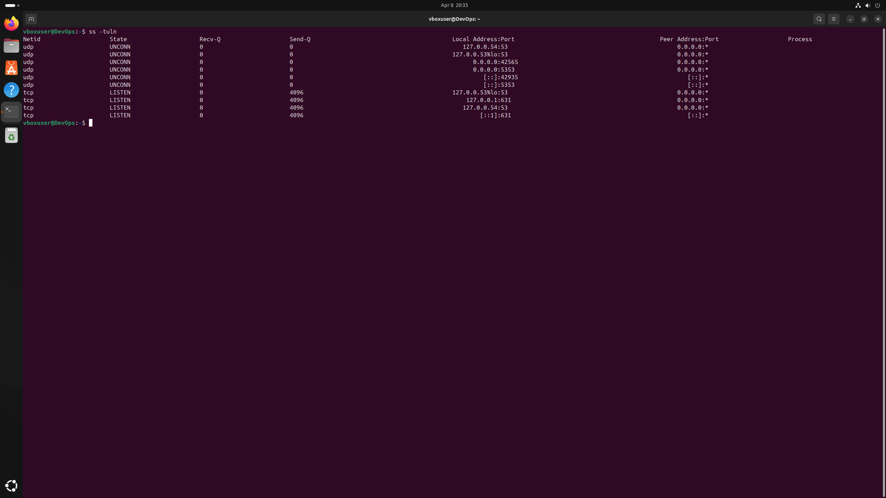
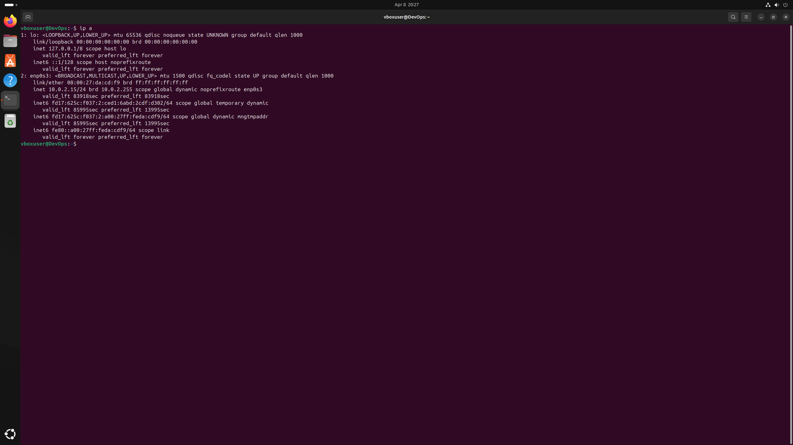
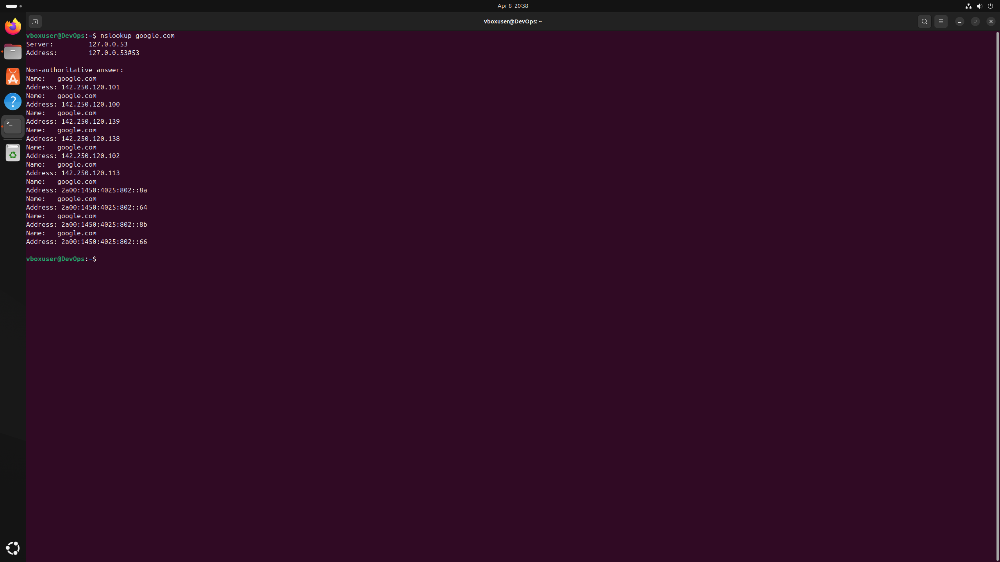
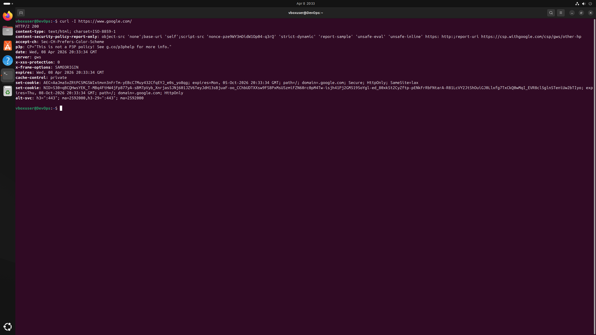

---

### Network Check Script

Created a bash script to automate network diagnostics:

- show IP address
- test internet connection
- check DNS resolution
- verify HTTP response

📸 Example:

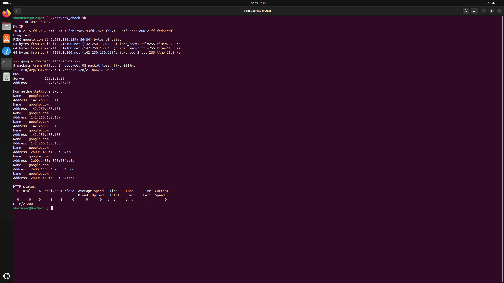

---

## Skills Learned

- Linux fundamentals
- Git & GitHub workflow
- System monitoring
- Log analysis
- Bash scripting
- Network diagnostics

---

## About Me

Beginner DevOps engineer.
Currently learning Linux, networking, and automation step by step.

---

## Next Steps

- Docker
- CI/CD basics
- GitHub Actions
- Cloud (AWS basics)
